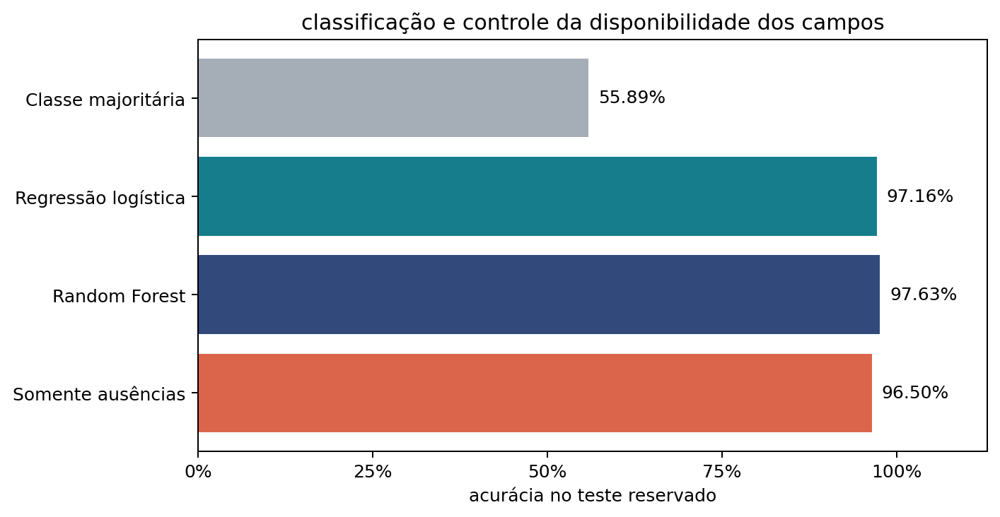
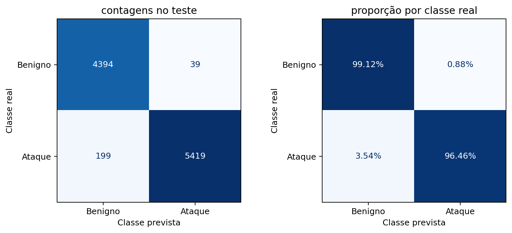
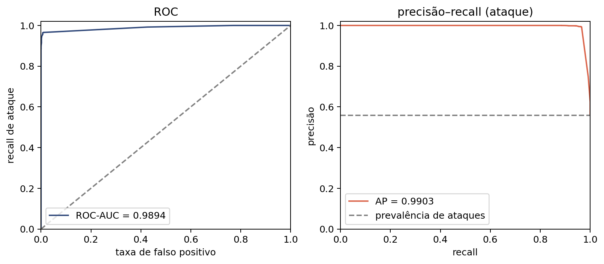
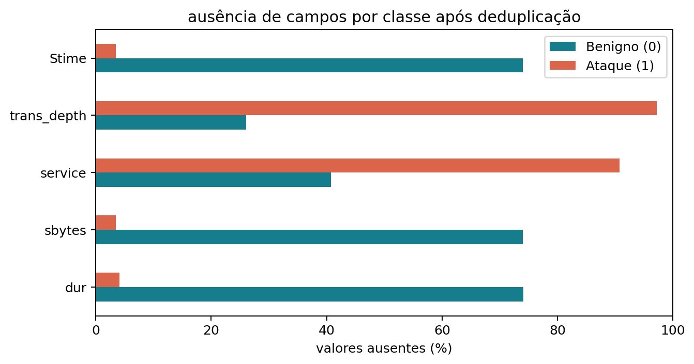

# Network Intrusion Lab

Classificação de conexões de rede como benignas ou ataques com Random Forest, avaliação com partições separadas por grupos de conexão e auditoria da qualidade dos dados. Experimento educacional.

## Pergunta

O modelo distingue os rótulos em conexões reservadas para teste? Quanto do resultado pode estar relacionado à ausência de dados e às características do laboratório?

## Dados

- Fonte: [Network Threat Detection Dataset](https://www.kaggle.com/datasets/rebsonramalho/network-threat-detection-dataset), de Rebson Ramalho, no Kaggle.
- Versão 2, arquivo Dataset_resumido.csv: 55.826 linhas, 24 colunas de atributos e o rótulo Label (0 = benigno, 1 = ataque). O arquivo Dataset_completo.csv não é usado.
- SHA-256 esperado: bd775a4e982055794c8feda3d4cfcb7ddcea1c4d4e4c4048f0cfcaf8bcd23445. O notebook e o script de download interrompem a execução se o hash for diferente.
- Os dados não fazem parte deste repositório. A licença do conjunto de dados deve ser consultada na página do Kaggle antes de qualquer redistribuição.
- Após a remoção de 5.572 duplicatas exatas, restam 50.254 registros: 22.164 benignos e 28.090 ataques.

## Método

- Atributos: nove medidas de tráfego (dur, sbytes, dbytes, Sload, Dload, Spkts, Dpkts, smeansz, dmeansz) e quatro variáveis categóricas (proto, state, service, ct_state_ttl). Endereços IP, portas e timestamps não entram no classificador.
- Grupos de conexão: o grupo é definido pelo protocolo e pelo par de endpoints (IP, porta), sem distinguir origem e destino. É uma aproximação de conexão: pode unir conexões com portas reutilizadas e não reúne todos os fluxos de uma campanha de ataque. Resultam 31.567 grupos.
- Partições: divisão estratificada por grupos em cinco folds. Um fold é reservado para teste; entre os demais, um fold de nova divisão em cinco é reservado para validação. Semente 42, sem busca de outra semente após a observação dos scores.

| Partição | Registros | Percentual | Grupos | Benignos | Ataques |
|---|---|---|---|---|---|
| Treino | 32.162 | 64,0% | 20.202 | 14.185 | 17.977 |
| Validação | 8.041 | 16,0% | 5.052 | 3.546 | 4.495 |
| Teste | 10.051 | 20,0% | 6.313 | 4.433 | 5.618 |

- Pré-processamento: imputação, codificação e escala aprendidas somente no treino. Mediana com indicador de ausência nos atributos numéricos, categoria MISSING nos categóricos, codificação one-hot e padronização apenas na regressão logística.
- Modelos: referência de classe majoritária, regressão logística com pesos balanceados e três configurações de Random Forest (150 árvores, pesos balanceados): profundidade máxima 12 com mínimo de 2 amostras por folha; sem limite de profundidade com mínimo de 2; sem limite de profundidade com mínimo de 1.
- Seleção: entre as três Random Forests, pelo maior Macro-F1 na validação (0,9742, 0,9744 e 0,9741). Foi escolhida a segunda configuração. Limiar de decisão 0,5, sem otimização sobre o teste e sem novo ajuste após a validação.
- Controle de ausências: árvore de decisão de profundidade 3, treinada somente com indicadores de ausência dos 13 atributos.
- Incerteza: intervalo percentil de 95% com 500 reamostragens dos grupos de conexão do teste.

## Resultados no teste reservado

| Modelo | Acurácia | Macro-F1 | Precisão (ataque) | Recall (ataque) | Taxa de falso positivo |
|---|---|---|---|---|---|
| Classe majoritária | 55,89% | 0,3585 | 0,5589 | 1,0000 | 100,00% |
| Regressão logística | 97,16% | 0,9714 | 0,9903 | 0,9587 | 1,20% |
| Random Forest selecionada | 97,63% | 0,9761 | 0,9929 | 0,9646 | 0,88% |
| Somente ausências | 96,50% | 0,9647 | 0,9942 | 0,9429 | 0,70% |

Random Forest selecionada:

- Matriz de confusão: 4.394 verdadeiros negativos, 39 falsos positivos, 199 falsos negativos e 5.419 verdadeiros positivos.
- ROC-AUC 0,9894; Average Precision 0,9903; Brier score 0,0216.
- Intervalos de 95%: acurácia de 0,9697 a 0,9815; Macro-F1 de 0,9694 a 0,9813; recall de ataque de 0,9545 a 0,9723.

Fatias de diagnóstico (Random Forest selecionada):

| Fatia | Registros | Benignos | Ataques | Acurácia | Macro-F1 | Recall (ataque) |
|---|---|---|---|---|---|---|
| Teste completo | 10.051 | 4.433 | 5.618 | 0,9763 | 0,9761 | 0,9646 |
| Medidas numéricas completas | 6.518 | 1.136 | 5.382 | 0,9929 | 0,9876 | 0,9985 |
| Atributos não vistos no treino | 3.876 | 1.134 | 2.742 | 0,9889 | 0,9865 | 0,9974 |

As fatias têm composição de classes diferente da do teste completo e não substituem o teste principal.







## Leitura dos resultados

- O controle que usa somente indicadores de ausência obtém 96,50% de acurácia, contra 97,63% da Random Forest. Não foi calculado intervalo para o controle, e a diferença entre os dois não foi testada.
- A ausência de campos está associada à classe. No teste, 1.136 de 4.433 benignos (25,6%) e 5.382 de 5.618 ataques (95,8%) têm todas as medidas numéricas. A figura abaixo mostra a proporção de valores ausentes por classe em alguns campos.
- Cerca de 61% dos registros de validação e de teste (61,88% e 61,44%) têm atributos idênticos aos de algum registro de treino. Igualdade de atributos entre conexões diferentes não implica vazamento, e a fatia de atributos não vistos no treino é reportada separadamente.
- A importância por permutação, calculada na validação, tem valores pequenos: a maior queda de Macro-F1 é de 0,0040 (proto), seguida de 0,0020 (service).



## Limitações

- Os resultados descrevem a classificação dos registros desta coleta. Não validam um sistema de detecção de intrusão em produção nem a detecção de famílias de ataque ausentes do treino.
- O agrupamento é aproximado e pode manter dependência entre partições.
- Há 39 representações idênticas de atributos com rótulos diferentes, mantidas nos dados.
- Portas ficam fora dos atributos para reduzir atalhos do laboratório, o que pode retirar informação útil. Métodos HTTP e URLs não foram usados.
- Os intervalos de confiança são condicionais a este teste. Não incluem mudanças de rede ou de campanha, seleção de hiperparâmetros nem novos treinamentos.
- Há uma única coleta, sem teste em outra rede.

## Estrutura do repositório

```bash
├── 01_network_intrusion_detection.ipynb # notebook principal
├── scripts/
│   └── download_data.py # download e verificação de hash dos dados
├── reports/
│   ├── figures/ # figuras geradas pelo notebook
│   └── results/ # tabelas, previsões e manifesto da execução
├── requirements.txt # dependências com versões
├── LICENSE # licença MIT
└── data/
    └── raw/ # criado pelo script de download, fora do controle de versão
```

Arquivos em reports/results:

- `validation_metrics.csv` e `test_metrics.csv`: métricas por modelo na validação e no teste.
- `classification_report.csv`: relatório de classificação da Random Forest selecionada no teste.
- `confidence_intervals.csv`: intervalos de 95% por reamostragem de grupos.
- `diagnostic_slices.csv`: métricas das fatias de diagnóstico.
- `permutation_importance_validation.csv`: importância por permutação na validação.
- `split_summary.csv`: resumo das partições.
- `test_predictions.csv` e `prediction_examples.csv`: previsões no teste e exemplos de cada tipo de resultado. Não contêm IPs, URLs nem timestamps.
- `run_manifest.json`: semente, limiar, modelo selecionado, hash dos dados e versões das bibliotecas da execução.

## Como executar

Requisitos: Python 3.12. 

As versões das bibliotecas estão em requirements.txt. 

### Linux

#### Crie a venv
```bash
python -m venv .venv
```

#### Entre na venv
```bash
source .venv/bin/activate
```

#### Instale as bibliotecas
```bash
pip install -r requirements.txt
```

#### Baixe o dataset
```bash
python scripts/download_data.py
```

### Windows
A ativação do ambiente é feita com 

```bash
.venv\Scripts\activate
```

Repita os mesmos passos do Linux.

## Referências

A lista completa de referências está na seção 11 do notebook.

Este material é um experimento educacional e uma revisão narrativa direcionada, não uma revisão sistemática nem uma demonstração de que o modelo supera o estado da arte.

## Licença

MIT. Ver o arquivo [LICENSE](LICENSE).